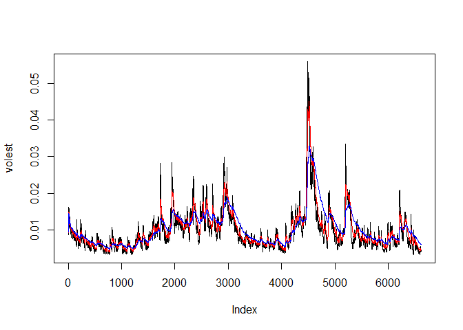

DDS\_Homework11\_NShaver
================
Nicole Shaver
April 3, 2017

Introduction
------------

In this study, we will examine the volatility of the S&P500 index using a time series plot. The S&P500 data will be downloaded from the default source of the get.hist.quote function in the tseries R package. We will plot the volatility of the S&P500 using 3 different decay factors (10,30,100) and graphically compare the data for the 3 different decay factors.

Link to GitHub
--------------

The link to the github for this project is: <https://github.com/NSHAVER1/MSDS6306-Homework11>.

The link to the markdown file specifically: <https://github.com/NSHAVER1/MSDS6306-Homework11/tree/master/paper>

Downloading the Data
--------------------

``` r
# Use the get.hist.quote function to get the closing price of S&P 500 (^gspc)
SNPdata <- get.hist.quote('^gspc',quote="Close")
```

Calculating the daily log returns and volatility measure
--------------------------------------------------------

``` r
# Calculate the daily log returns (SNPret) by subtracting log(SNPdata) from log(lag(SNPdata))
SNPret <- log(lag(SNPdata))- log(SNPdata)

#Calculate the volatility measure, SNPvol
SNPvol <- sd(SNPret)*sqrt(250)*100

## Define getVol function for volatility
getVol <- function(d, logrets) {
    var = 0
    lam = 0
    varlist <- c()

    for (r in logrets) {
        lam = lam*(1 - 1/d) + 1
      var = (1 - 1/lam)*var + (1/lam)*r^2
        varlist <- c(varlist, var)
    }

    sqrt(varlist)
}


# Calculate volatility over entire length of series for various three different decay factors: 10 30. 100


# Calculate volatility for SNP with decay factor of 10
volest <- getVol(10,SNPret)

# Calculate volatility for SNP with decay factor of 30
volest2 <- getVol(30,SNPret)

# Calculate volatility for SNP with decay factor of 100
volest3 <- getVol(100,SNPret)
```

Plotting the data to compare the 3 volatility measures
------------------------------------------------------

``` r
# Plot the results, overlaying the volatility curves on the data, just as was done in the S&P example.
plot(volest,type="l")

# Add a red line to volest2
lines(volest2,type="l",col="red")

# Add a blue line to volest2
lines(volest3,type="l",col="blue")
```



Discussion and Conclusions
--------------------------

Reviewing the plot of the 3 different volatility measures, we see that as the decay factor increases (from 10=black to 30=red to 100=blue), the line becomes smoother, dampening the height of the sharp peaks and slowing the rate of decay.
